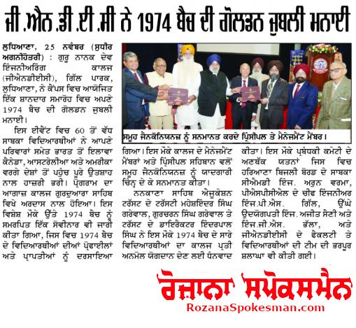
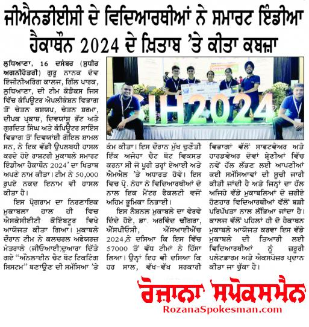
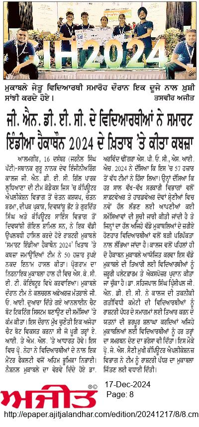

#GNDEC IN NEWS

# GNDEC Conducts Workshop on AI and Punjabi Language

#### 🕒 Published on June 25, 2024

Guru Nanak Dev Engineering College, Gill Park, Ludhiana, recently hosted a three-day workshop titled “Artificial Intelligence and Punjabi Language: Recent Trends and Challenges,” sponsored by the All India Council for Technical Education (AICTE) under the VAANI scheme. The workshop aimed to equip participants with a thorough understanding of AI and its applications in the Punjabi language.

Dr. Parminder Singh and Mr. Lakhbir Singh, the coordinators, highlighted the workshop's goal of making AI accessible to a broader audience. The event featured a mix of lectures and interactive sessions covering AI history, machine learning, natural language processing, computer vision, ethical considerations, and the challenges of AI in Punjabi.

Prominent experts including Dr. Gurpreet Singh Lehal, Dr. Munish Jindal, Dr. Gurpreet Singh Josan, Dr. Neeraj Julka, Dr. Munish Kumar, and Dr. C.P. Kamboj conducted various sessions. Around 50 participants from various institutions attended the workshop.

Principal Dr. Sehijpal Singh appreciated the initiative taken by the coordinators and said that such programs play a significant role in promoting modern technologies. The event concluded in the presence of S. Inderpal Singh (Director, NSET), Dr. Amarjit Singh Grewal, Er. Jaswant Zafar, Dr. Jasmaninder Singh Grewal, and Dr. Kiran Jyoti. Principal Dr. Sehijpal Singh said, “This initiative represents a significant step in promoting AI literacy and preparing individuals for transformative technology.”

---

# GNDEC Organised Anti-Ragging Day and Nasha Mukt Abhiyaan

#### 🕒 Published on August 15, 2024

Guru Nanak Dev Engineering College, Ludhiana organised Anti-Ragging Day and Nasha Mukt Abhiyaan on the campus. As per the directions from the Ministry of Social Justice and Empowerment, Government of India, more than 650 students and eleven faculty members took the pledge against drug abuse.

Dr. Arvind Dhingra, Chairman of the Technical Activity Committee, administered the pledge. Dr. Parminder Singh, Dean (Student Welfare), introduced the students to Anti-Ragging Day and informed them that as per UGC guidelines, Anti-Ragging Week would be observed from August 12 to August 18, 2024.

A host of activities such as poster making, reel making, and social media contests will be organised during the week. The speaker of the day, Dr. Sarabjeet Singh Renuka, Professor (Journalism), PAU Ludhiana, addressed the students on this occasion.

In his inimitable style and simple words, he highlighted how ragging is an anti-social activity. He explained in detail about peer learning and how it impacts a person’s personality. He also elaborated on the concept of “learn how to learn.” Citing extensively from Gurbani, he advocated choosing peers carefully.

Dr. Sehijpal Singh, Principal, GNDEC, stated that the college campus is a ragging-free campus. He emphasized the importance of peer learning and informed that all helpline numbers for anti-ragging committees have been displayed at various places on campus.

S. Inderpal Singh, Director, Nankana Sahib Education Trust, exhorted the students to take today’s learnings seriously and apply them throughout their lives.

---

# GNDEC Faculty Honored in Stanford University's Top 2% Scientists List

#### 🕒 Published on September 21, 2024

Guru Nanak Dev Engineering College (GNDEC) is proud to announce that two of its esteemed faculty members have been recognized in Stanford University's prestigious list of the World's Top 2% Scientists.

Dr. Raman Kumar Sehgal from the Mechanical and Production Engineering Department has received this honor for the third consecutive year, while Dr. Sita Rani from the Computer Science and Engineering Department has been acknowledged for 2024.

Their relentless commitment to research and innovation has elevated the standards of their respective fields and significantly contributed to the global scientific landscape.

Dr. Sehijpal Singh, Principal of GNDEC, expressed that this achievement is expected to inspire and energize students, faculty, and researchers alike, further solidifying the college’s standing as a premier institution for research and academic excellence.

He noted, “Their inclusion in such a prestigious list not only highlights their personal achievements but also showcases the college's strong academic and research ethos.”

---

# IKGPTU Inter-College Cycling Competition 2024 Hosted by GNDEC

#### 🕒 Published on October 1, 2024

Guru Nanak Dev Engineering College (GNDEC), Gill Park, Ludhiana, hosted the IKGPTU Inter-College Cycling Competition for men and women at the PAU Cycling Velodrome on October 1, 2024.

This prestigious event witnessed participation from top cyclists representing seven colleges affiliated with I.K. Gujral Punjab Technical University (IKGPTU), Kapurthala, showcasing their talent, endurance, and competitive spirit.

The competition featured multiple races including sprint, time trial, individual pursuit, team sprints, and scratch races, attracting enthusiastic participants from across the region. Both men's and women's categories saw intense competition, with athletes displaying exceptional skill and determination.

The event aimed to promote cycling as a sport and encourage students to embrace fitness and an active lifestyle. The event was evaluated by Dr. Paramvir Singh from PAU, who was appointed by IKGPTU.

Speaking on the occasion, Principal Dr. Sehijpal Singh emphasized the importance of sports in holistic development and commended the efforts of the organizing committee.

The event concluded with an award ceremony where winners were felicitated with medals and certificates. Dr. J.S. Grewal, President of Sports at GNDEC, along with sports coordinators Dr. Gunjan Bhardwaj and Shaminder Singh, were honored with special recognition for their outstanding contributions to the successful coordination of the event.

---

# GNDEC Hosts Workshop on Intellectual Property in Collaboration with PSCST to Mark World IP Day

#### 🕒 Published on October 1, 2024

To promote innovation and equip students and faculty with essential knowledge, the IPMCC GNDEC, in collaboration with the Punjab State Council of Science and Technology (PSCST), successfully hosted a comprehensive workshop titled “IP Blueprint: Navigating Intellectual Property” to celebrate World IP Day.

The event brought together industry experts, intellectual property practitioners, innovators, and academicians to discuss the pivotal role of intellectual property in today’s competitive landscape.

Dr. Divya Kaushik, Patent Scientist at PSCST, shared insights into different types of intellectual property and discussed various case studies. Dr. Ruchi Singla, Director of RAS Intellect Solutions, Mohali, shared her expertise on filing and protecting intellectual property rights.

Dr. Khushdeep Dharni, Associate Director (Technology and Marketing) and IPR Cell, PAU Ludhiana, acquainted the audience with the commercialization aspects of intellectual property.

# GNDEC Hosts Spectacular GNE'S APEX 2024: A Showcase of Innovation and Talent

#### 🕒 Published on October 25, 2024

Guru Nanak Dev Engineering College (GNDEC), Gill Road Ludhiana, welcomed the much-anticipated inter-school extravaganza, GNE'S APEX 2024, on October 25th, 2024. Organized by the Causmic Club under the Department of Applied Science, this event paid homage to the legendary leadership and humanitarian contributions of Mr. Ratan N. Tata. The event witnessed enthusiastic participation from 30 schools, creating an atmosphere filled with excitement and camaraderie.

The day began with an enlightening session by Shiksha Ratan Dr. Jaswinder Singh, President of IAPT RC-2, who mesmerized the audience with engaging demonstrations of physics concepts. His interactive approach inspired curiosity, leading to students actively engaging in a variety of hands-on activities, such as Fork Dancing, Rangoli Marvels, Pencil Shading, Digital Identity, Reel Artistry, Young Entrepreneurs, Mime, Web Wizards, Assumption Edge, G.K Quiz, Media Spotlight, The Logical Shuffle, and many more.

One of the key attractions was THE APEX FAIR, where GNDEC's professional societies and clubs showcased technical games and creative activities for school participants.  

Dr. Harpreet Kaur, Head of the Department of Applied Sciences, highlighted the importance of events like APEX in fostering students’ holistic growth, beyond just academics. She applauded the dedication and teamwork of the GNDEC GENCONIANS in making the event a grand success. The Guest of Honour, Mrs. Harmeet Kaur Waraich, Principal of Nankana Sahib Public School, Gill Road, lent grace and warmth to the event with her presence.

Dr. Sehijpal Singh, Principal of GNDEC, marked the event as an invaluable opportunity for students to forge new friendships, engage with like-minded peers, and unearth hidden talents. Director Nankana Sahib Education Trust, S. Inderpal Singh, extended heartfelt gratitude to the APEX team and commended the efforts of Dr. Randhir Singh (Coordinator and Dr. Rajvir Kaur (Co-Coordinator, Causmic Club) for their seamless organization.

# GNDEC Annual Alumni Meet 2024: Creating Unforgettable Memories 

#### 🕒 Published on November 10, 2024

Guru Nanak Dev Engineering College (GNDEC), Gill Park, Ludhiana, recently hosted its Annual Alumni Meet, bringing together graduates from 1960 to the 2022 batch. Alumni from India, as well as from U.S., Canada, Australia, and the U.K., gathered to reconnect and contribute to the college’s development, making this a truly global event. The program began with a group of current students reciting shabad kirtan and setting a warm and nostalgic tone for the day.

The Secretary of the GNDEC Alumni Association, Er. Arvinder Singh, and Er.G.S. Brar presented the annual report, detailing achievements and audit reports from the past year. In a special highlight, Mr. Harpreet Singh Cheema, a 1998 batch alumnus, and his wife were honored for becoming the first Sikh couple to conquer Mount Everest in 2024. 

The event also marked the election of a new Executive Committee for 2024-2026, with Er. S.M.S. Sandhu, former Chief Engineer (1972 batch), being elected as the new President. A heartfelt tribute was extended to Mr. Gurbir Singh Sandhu, Olympian and Arjuna Awardee, for his invaluable contributions as the association’s former President.

GNDEC Principal Dr. Sehijpal Singh expressed his gratitude to the alumni for their generous contributions. The 1973 batch and Tricity Genconians contributed to establish a state-of-the-art Computer Lab and a Computational Research Lab, while the NRI Alumni from the 1991 and 1992 batches funded the development of a modern classroom, collectively raising over 40 lakhs for these projects.

# Industry-Institute Meet Organized at GNDEC Ludhiana

#### 🕒 Published on November 21, 2024

Guru Nanak Dev Engineering College (GNDEC), Ludhiana, conducted an Industry-Institute Meet, facilitated by the Department of Mechanical & Production Engineering and the Industrial Relations Cell. The event aimed to foster collaboration between academia and industry, ensuring students are equipped with industry-relevant skills to meet evolving market demands.

Prominent industrial leaders attended the meet, including Mr. Jagbir Singh Sokhi (President, Sewing Machine Development Cell), Mr. Narinder Bhamra (President, Fasteners Manufacturers Association of India), Mr. Gurpreet Singh Kalhon (Senior Vice President, Auto Parts Manufacturers India), and Mr. Harsimerjit Singh (President, United Cycle Parts, Ludhiana). Representatives from leading firms, including Steel Shuttering Industries, Pioneer Cranes, Compac Technology, Barnala Engineers, and Arora Steels, also participated.

Dr. Sehijpal Singh, Principal of GNDEC, said this meet marked another step toward strengthening ties between GNDEC and the industrial sector, promoting innovation, and fostering skill development among students. 
Prof. J.S. Grewal extended a warm welcome to the participants. Dr. Jatinder Kapoor, Dean of the Industrial Relations Cell, highlighted the objectives of the event, emphasizing the importance of bridging the academia-industry gap. The program concluded with a vote of thanks by Dr. Harmeet Singh, Head of the Mechanical & Production Engineering Department.

# GNDEC Celebrates Golden Jubilee of 1974 Batch

#### 🕒 Published on November 25, 2024

  
Guru Nanak Dev Engineering College (GNDEC), Ludhiana, recently commemorated the Golden Jubilee of its 1974 batch in a grand celebration held on campus. The event witnessed the enthusiastic participation of over 60 alumni, accompanied by their families, who travelled from across India and countries like Canada, Australia, and the USA to reconnect and celebrate this milestone. The alumni meet started with ardass at college Gurdwara sahib.

On this special occasion, a souvenir dedicated to the 1974 batch was released, showcasing the profiles and achievements of the batch. The management members and Principal of the college honoured all the Genconians with mementos.Trustees of Nankana Sahib Education Trust Maheshinder Singh Grewal, Gursharan Singh Grewal and Director, of Trust Inderpal Singh expressed their heartfelt congratulations and gratitude to the 1974 batch for their generous contributions. They also reaffirmed that they will support for the continued growth and continuous development of GNDEC. 

Principal Sehijpal Singh said that 1974 batch support is instrumental in strengthening the institution’s foundation and encouraging new avenues for growth and innovation. The 1974 batch was lauded for their significant contribution toward establishing a Center for Experiential Learning, a visionary initiative aimed at fostering innovation and supporting new projects and hands-on practice for the budding engineers. Their financial assistance of 20 lakhs has set an inspiring example of alumni commitment to their alma mater. 

The tireless efforts of the organizing committee, which included the former CMD of Haryana Electricity Board Er. Arun Verma, the Chief Engineer of PSPCL Er P.S Gill, leading industrialists Er. Ajit Saini and Er. G.S Bhalla, and a team of faculty and students of GNDEC, were highly appreciated.This celebration not only marked 50 years of the 1974 batch's legacy but also reinforced the strong bond between GNDEC and its alumni community.
the organizing committee, which included the former CMD of the Haryana Electricity Board Er. Arun Verma, the Chief Engineer of PSPCL Er P.S Gill, leading industrialists Er. Ajit Saini and Er. G.S Bhalla, and a team of faculty and students of GNDEC

# GNDEC students win Smart India Hackathon 2024

#### 🕒 Published on December 16, 2024

  
Guru Nanak Dev Engineering College (GNDEC) Ludhiana team Codex comprising of Chetan Kashyap, Chetan Sharma, Deepak Parkash, Divyanshu Bhatt and Gurdit Singh from Computer Applications Department and Divanshi Goyal from Computer Science Department won the prestigious national competition 'Smart India Hackathon 2024'. The grand finale of the event was held recently at SKCET Coimbatore. The team worked on the problem of creating an  “Online chat bot ticketing system” given by the Ministry of Cultural Affairs GOI. The challenge was to develop a chat bot, which would be fully based on  AI and ML. Prof. Neha accompanied the students as Mentor faculty. Giving details of the event, Dr. Arvind Dhingra, SPOC, SIH 2024 said that more than 57000 teams participated in the event. Every year, various Government departments list their problems for finding novel solutions both in software and hardware categories. The college had provided necessary platform and exposure to prepare for the grand event by holding two hackathons in house. Prof. J.S. Saini, HOD, Computer Applications congratulated the team for winning the accolades at national level. The team has won Rs.50000/- as cash prize. Dr. Sehijpal Singh, Principal appreciated the efforts of the Technical Activity Committee of the college for preparing the students for national level events and assured  all support for the students for such events.

# TATA steel ties up with GNDEC for developing modern lab at Campus.

#### 🕒 Published on Janurary 16, 2024

  
Guru Nanak Dev Engineering College (GNDEC) and Tata Steel have signed a Memorandum of Understanding (MoU) to establish an industry-supported laboratory on the college campus, showcasing best practices in structural designing and detailing of reinforced concrete buildings. The lab will feature a touch-and-feel facility; demo zones exhibiting rebar production and case studies, and offer structural design services to the public.The collaboration will enable the exchange of expertise, resources, and knowledge between GNDEC and Tata Steel, leading to the development of industry-relevant curriculum, joint research projects, and training programs for professionals. The MoU is Signed by Mr. Hemant Bhargava, Chief Sales Manager (North) of Tata steel, Mr. Pardeep Malhotra, Distributor, and Dr. Sehijpal Singh Principal. It aims to promote excellence in engineering education, foster industry-academia collaboration, and help builders select appropriate materials, reducing construction costs while meeting safety provisions outlined in BIS guidelines.
Dr Harvinder Singh Dean Research and Consultancy said "The laboratory will also serve as a hub for research and development, providing students and faculty with hands-on experience in cutting-edge technologies and fostering innovation in the field of structural designing".  Accordjng to Dr Jagbir Singh HOD Civil Engg . This initiative is expected to have a profound impact on the engineering education landscape, promoting industry-academia collaboration, and contributing to the development of a skilled and knowledgeable workforce.

# "Anand Utsav 2025" Ignites Festivities at GNDEC

#### 🕒 Published on March 6, 2025

Guru Nanak Dev Engineering College (GNDEC), Gill Park, Ludhiana, resonated with exuberance and cultural vibrancy as the highly anticipated two-day fair, "Anand Utsav 2025," kicked off on March 6, 2025. The event captivated participants and attendees alike with its diverse array of cultural competitions, fostering an atmosphere of celebration and camaraderie.

The festivities encompassed a wide range of activities, including solo and group dances, skits, folk dances, mehndi, rangoli, clay modeling, photography, poster making, and many more. Students from various departments of GNDEC showcased their talents with enthusiasm, contributing to the lively spirit of the event. Distinguished judges from various fields and esteemed institutions of the region ensured impartial adjudication of the competitions. 

Renowned Punjabi actor Padsm Shri Ms. Nirmal Rishi, graced the occasion with her esteemed presence, offering insightful perspectives and urging students to uphold the values of truth and respect for their culture. The event also saw the participation of notable guests such as Pali Detwalia, the renowned Punjabi singer, Harkirat Kaur Chahal, a celebrated Punjabi writer, and Ashok Bansal, a prominent writer, who all lauded the students of GNDEC for their remarkable achievements across various fields. 

Dr. Sehijpal Singh, Principal of GNDEC, underscored the importance of such events in nurturing students' confidence and fostering cultural appreciation.  S. Iqbal Singh, Director of Nankana Sahib Education Trust, applauded the exemplary participation and performance of students, acknowledging the diligent efforts of the Cultural Committee.  
S. Gurcharan Singh Grewal, Senior Trustee, NSET, commended the students of GNDEC for their achievements in various fields, emphasizing their consistent success in education, sports, and cultural activities.

The seamless organization and successful execution of "Anand Utsav 2025" were attributed to the dedicated efforts of Dr. K.S. Mann, Prof. Jaswant Singh Taur, Dr. Parampal Singh, along with the program coordinators and members of the Cultural Committee.

# IKGPTU 27th Annual Athletic Meet Held at GNDEC, Ludhiana

#### 🕒 Published on March 20, 2025

Guru Nanak Dev Engineering College (GNDEC), Ludhiana, successfully hosted the 27th Annual Athletic Meet of I.K. Gujral Punjab Technical University (IKGPTU) on March 20-21, 2025. The event began with a march past by athletes from 20 colleges, showcasing discipline and team spirit.

Dr. Sehijpal Singh, Principal of GNDEC, welcomed participants, emphasizing the importance of fitness and sportsmanship. Chief Guest Dr. Susheel Mittal, Vice Chancellor of IKGPTU, officially inaugurated the meet, with Dr. Vishavjeet Singh Hans (PAU, Ludhiana) as the Guest of Honour.

The two-day event featured various track and field competitions, including sprints, middle and long-distance races, hurdles, relay races, high jump, long jump, triple jump, shot put, javelin throw, discus throw, and hammer throw.

Key officials included Dr. Satvir Singh (Dean Student Welfare), PTU Observer S. Bhupinder Singh, and the Jury of Appeal members. The event was coordinated by Dr. Sameer Sharma (OI/C Sports, PTU) and Dr. Gunjan Bhardwaj (GNDEC).

Mr. Sameer Sharma, PTU Sports Incharge, applauded the athletes’ dedication and competitive spirit. The meet concluded with a grand prize distribution, where winners were honored with medals and trophies.

Dignitaries commended the participants and organizers for making the event a success. Dr. Sehijpal Singh and Dr. Susheel Mittal reaffirmed the university’s commitment to promoting sports alongside academics, fostering teamwork, perseverance, and sportsmanship among students.

# GNDEC commenced platinum jubilee  celebrations

#### 🕒 Published on April 8, 2025

Guru Nanak Dev Engineering College (GNDEC) kick-started the celebrations for the 70th year of its establishment. The Foundation Day celebrated the milestones in the institution’s enduring legacy of academic excellence, innovation, and service to society.

The day commenced with a spiritual session featuring the recitation of Path Sri Sukhmani Sahib Ji and soulful Kirtan by Bhai Shaukeen Singh Ji, Hazuri Ragi from Sri Darbar Sahib, creating a serene and devotional atmosphere. This was followed by the launch of a vibrant lineup of events, including ACME 2025, an Inter-College Competition sponsored by Landmark Immigration and co-powered by AECC Study Abroad Consultants, Geek Bees, Coca-Cola, SK Trophy,  KT sweets and equitas small finance bank. The event is dedicated to former Principal Dr. S.B Singh. The day also saw the continuation of the Jugaad Mela, a dynamic showcase of creativity and technical ingenuity.

The celebrations culminated with a Prize Distribution Ceremony held in the Auditorium where winners of various competitions were felicitated. Principal Dr. Sehijpal Singh appreciated the dedication and participation of students and faculty, reaffirming GNDEC’s commitment to fostering academic innovation and holistic development. President of GENCO Alumni Association Er. S.M.S Sandhu and Er. H.S Dhillon, General Secretary, gave away several awards, including best student, best teacher, outstanding department award. The college magazine and a logo for the platinum year were released on the occasion

Dr. Parminder Singh (Dean Student Welfare), Dr. Harpreet Kaur (HoD, Applied Sciences), and Dr. Arvind Dhingra (EE Dept.) led the organizing efforts, ensuring a seamless blend of technical excellence and cultural richness throughout the celebration.

The Foundation Day was observed with great enthusiasm, bringing together students, faculty, alumni, and distinguished guests to reflect on the institution’s illustrious journey and to reaffirm its mission of nurturing future leaders and changemakers.

 

# Orientation Program for Punjab100 Concludes at GNDEC, Ludhiana 

#### 🕒 Published on April 18, 2025

Guru Nanak Dev Engineering College, Gill Park Ludhiana hosted the orientation ceremony for the selected candidates of Punjab100 Phase 3, an initiative by Prayas Educational and Charitable Society in association with CML society, GNDEC aimed at empowering 100 girls from Punjab with free online CAT coaching.

The program, inspired by the Super 30 model, seeks to prepare young women from economically weaker sections for India’s top business schools and future corporate leadership. Phase 3 candidates, along with their parents, attended the session where documents were verified, program details were shared, and selection letters were distributed.

The event was graced by Chief Guest Mrs. Swati Munjal and motivational speaker Ms. Mandeep Tangra, all of whom inspired the students to make the most of this opportunity and pursue their goals with determination. Mr. Sony Goyal, Founder of Punjab100, emphasized the initiative’s long-term vision to see 100 deserving women enter and excel in India’s premier B-schools. Dr. Sehijpal Singh, Principal, GNDEC, said we are proud to support such efforts that align with our vision of inclusive and empowering education.

The successful execution of the event was made possible through the dedicated efforts of Himani, Siddharth, Parul Arora, Aditi Singla, Haider Ali, and Simrat Sandhu. We were honored by the presence of several distinguished guests, including Er. H.S. Dhillon, Prof. Lakhbir Singh, Mr. Vijay Kant Goyal, Mrs. Shabnam Singla, Mr. Teerath Pal Singh, and Mr. Jai Singh. The session concluded on a high note, with enthusiastic participation from students, unwavering support from volunteers, and heartfelt gratitude.

 

**PRO & Office Incharge Workshop: Dr. Satjot Singh Dhillon**   

**APRO: Dr. Preeti Pannu**

**Student Executive Member: Tanmay Kaushal (URN:2302934, ECE Branch)**

